[](https://github.com/sponsors/ChunkyTortoise)

# docqa-engine

**Upload documents, ask questions -- get cited answers with a prompt engineering lab.**


[](https://ct-document-engine.streamlit.app)

**[Live Demo](https://ct-document-engine.streamlit.app)** -- try it without installing anything.

## Demo Snapshot


## 🚀 Pro Version Available

Get production-ready features with the Pro version:

| Feature | GitHub (Free) | Pro ($25) |
|---------|---------------|-----------|
| Basic RAG pipeline | ✓ | ✓ |
| Document upload & chunking | ✓ | ✓ |
| Hybrid retrieval (BM25 + dense) | ✓ | ✓ |
| Prompt engineering lab | ✓ | ✓ |
| Extended documentation | - | ✓ |
| Docker deployment files | - | ✓ |
| CI/CD workflows | - | ✓ |
| Cloud deployment guides | - | ✓ |
| Priority email support | - | ✓ |

**[Get the Pro Version →](https://gumroad.com/l/docqa-engine-pro)**

## What This Solves

- **RAG pipeline from upload to answer** -- Ingest documents (PDF, DOCX, TXT, MD, CSV), chunk them with pluggable strategies, embed with TF-IDF, and retrieve using BM25 + dense hybrid search with Reciprocal Rank Fusion
- **Prompt engineering lab for A/B testing** -- Create prompt templates, run the same question through different strategies side-by-side, compare outputs
- **Citation accuracy matters** -- Faithfulness, coverage, and redundancy scoring for every generated citation

## Business Impact

Quantified outcomes from production document intelligence deployments:

### Key Metrics

| Metric | Before | After | Improvement |
|--------|--------|-------|-------------|
| Document review time | 3 days | 3 minutes | **99% faster** |
| Contract analysis accuracy | 72% | 94% | **31% improvement** |
| Research hours per case | 8 hours | 45 minutes | **91% reduction** |
| API costs per 1K queries | $180 | $24 | **87% reduction** |

### Additional Outcomes

- **Hybrid retrieval outperforms BM25-only by 15-25%** -- Combining sparse + dense vectors finds relevant passages traditional search misses
- **Citation scoring ensures answer reliability** -- Faithfulness, coverage, and redundancy metrics for every generated citation
- **No external embedding API required** -- Local TF-IDF embeddings eliminate vendor lock-in and reduce costs
- **<100ms query latency** -- Sub-second response times for 10K document corpus

### Use Cases

| Industry | Use Case | Outcome |
|----------|----------|---------|
| **Legal** | Contract analysis and discovery | 99% faster document review |
| **Finance** | SEC filing analysis and due diligence | 91% reduction in research time |
| **Healthcare** | Medical literature review and compliance | 87% cost reduction on document Q&A |
| **Enterprise** | Internal knowledge base search | 15-25% better retrieval accuracy |

## Service Mapping

- **Service 3:** Custom RAG Conversational Agents
- **Service 5:** Prompt Engineering and System Optimization

## Certification Mapping

- IBM Generative AI Engineering with PyTorch, LangChain & Hugging Face
- IBM RAG and Agentic AI Professional Certificate
- Vanderbilt ChatGPT Personal Automation
- Duke University LLMOps Specialization

## Architecture

```mermaid
flowchart TB
    Upload["Document Upload\n(PDF, DOCX, TXT, MD, CSV)"]
    Chunk["Chunking Engine\n(semantic, fixed, sliding window)"]
    Embed["Embedding Layer\n(TF-IDF, BM25, Dense)"]
    VStore["Vector Store\n(FAISS / in-memory)"]
    Hybrid["Hybrid Retrieval\n(BM25 + Dense + RRF fusion)"]
    Rerank["Cross-Encoder Re-Ranker"]
    QExpand["Query Expansion\n(synonym, PRF, decompose)"]
    Citation["Citation Scoring\n(faithfulness, coverage, redundancy)"]
    Answer["Answer Generation"]
    Convo["Conversation Manager\n(multi-turn context)"]
    API["REST API\n(JWT auth, rate limiting, metering)"]
    UI["Streamlit Demo UI\n(4-tab interface)"]

    Upload --> Chunk --> Embed --> VStore
    QExpand --> Hybrid
    VStore --> Hybrid --> Rerank --> Answer
    Answer --> Citation
    Answer --> Convo
    API --> Answer
    UI --> API
```



## Key Metrics

| Metric | Value |
|--------|-------|
| Test Suite | 550+ automated tests |
| Retrieval Accuracy | Hybrid > BM25-only by 15-25% |
| Re-Ranking Boost | +8-12% relevance improvement |
| Query Latency | <100ms for 10K document corpus |
| Citation Accuracy | Faithfulness + coverage scoring |
| API Rate Limit | Configurable per-user metering |

## Modules

| Module | File | Description |
|--------|------|-------------|
| **Ingest** | `ingest.py` | Multi-format document loading (PDF, DOCX, TXT, MD, CSV) |
| **Chunking** | `chunking.py` | Pluggable chunking strategies: fixed-size, sentence-boundary, semantic |
| **Embedder** | `embedder.py` | TF-IDF embedding (5,000 features, no external API calls) |
| **Retriever** | `retriever.py` | BM25 + dense cosine + hybrid RRF fusion |
| **Answer** | `answer.py` | Context-aware answer generation with source citations |
| **Prompt Lab** | `prompt_lab.py` | Prompt versioning and A/B comparison framework |
| **Citation Scorer** | `citation_scorer.py` | Citation faithfulness, coverage, and redundancy scoring |
| **Evaluator** | `evaluator.py` | Retrieval metrics: MRR, NDCG@K, Precision@K, Recall@K, Hit Rate |
| **Batch** | `batch.py` | Parallel batch ingestion and query processing |
| **Exporter** | `exporter.py` | JSON/CSV export for results and metrics |
| **Cost Tracker** | `cost_tracker.py` | Per-query token and cost tracking |
| **Pipeline** | `pipeline.py` | End-to-end DocQAPipeline class |
| **REST API** | `api.py` | FastAPI wrapper with JWT auth, rate limiting, metering |
| **Vector Store** | `vector_store.py` | Pluggable vector store backends (FAISS, in-memory) |
| **Re-Ranker** | `reranker.py` | Cross-encoder TF-IDF re-ranking with Kendall tau |
| **Query Expansion** | `query_expansion.py` | Synonym, pseudo-relevance feedback, decomposition |
| **Answer Quality** | `answer_quality.py` | Multi-axis answer quality scoring |
| **Summarizer** | `summarizer.py` | Extractive and abstractive document summarization |
| **Document Graph** | `document_graph.py` | Cross-document entity and relationship graph |
| **Multi-Hop** | `multi_hop.py` | Multi-hop reasoning across document chains |
| **Conversation Manager** | `conversation_manager.py` | Multi-turn context tracking and query rewriting |
| **Context Compressor** | `context_compressor.py` | Token-budget context window compression |
| **Benchmark Runner** | `benchmark_runner.py` | Automated retrieval and performance benchmarking |

## Quick Start

```bash
git clone https://github.com/ChunkyTortoise/docqa-engine.git
cd docqa-engine
pip install -r requirements.txt
make test
make demo
```

## Docker Quick Start

The fastest way to run DocQA Engine with Docker:

```bash
# Clone and start
git clone https://github.com/ChunkyTortoise/docqa-engine.git
cd docqa-engine
docker-compose up -d

# Open http://localhost:8501
```

### Docker Commands

| Command | Description |
|---------|-------------|
| `docker-compose up -d` | Start demo in background |
| `docker-compose down` | Stop and remove containers |
| `docker-compose logs -f` | View logs |
| `docker-compose build` | Rebuild image |

### Docker Build (Manual)

```bash
# Build the image
docker build -t docqa-engine .

# Run the container
docker run -p 8501:8501 -v ./uploads:/app/uploads docqa-engine

# Open http://localhost:8501
```

### With API Keys (Optional)

To enable LLM-powered answer generation:

```bash
# Create .env file with your API keys
echo "ANTHROPIC_API_KEY=your_key_here" > .env

# Start with environment variables
docker-compose --env-file .env up -d
```

### Image Size

The optimized multi-stage build produces images under 500MB:
- Base: Python 3.11 slim (~150MB)
- Dependencies: scikit-learn, Streamlit, etc. (~200MB)
- Application: ~50MB

## Demo Documents

| Document | Topic | Content |
|----------|-------|---------|
| `python_guide.md` | Python Basics | Variables, control flow, functions, classes, error handling |
| `machine_learning.md` | ML Concepts | Supervised/unsupervised, regression, classification, neural networks |
| `startup_playbook.md` | Startup Advice | Product-market fit, MVP, fundraising, team building, metrics |

## Tech Stack

| Layer | Technology |
|-------|-----------|
| UI | Streamlit (4 tabs) |
| Embeddings | scikit-learn (TF-IDF) |
| Retrieval | BM25 (Okapi) + Dense (cosine) + RRF |
| Document Parsing | PyPDF2, python-docx |
| Testing | pytest, pytest-asyncio (550+ tests) |
| CI | GitHub Actions (Python 3.11, 3.12) |
| Linting | Ruff |

## Project Structure

```
docqa-engine/
├── app.py                          # Streamlit application (4 tabs)
├── docqa_engine/
│   ├── ingest.py                   # Document loading + parsing
│   ├── chunking.py                 # Pluggable chunking strategies
│   ├── embedder.py                 # TF-IDF embedding
│   ├── retriever.py                # BM25 + Dense + Hybrid (RRF)
│   ├── answer.py                   # LLM answer generation + citations
│   ├── prompt_lab.py               # Prompt versioning + A/B testing
│   ├── citation_scorer.py          # Citation accuracy scoring
│   ├── evaluator.py                # Retrieval metrics (MRR, NDCG, P@K)
│   ├── batch.py                    # Parallel batch processing
│   ├── exporter.py                 # JSON/CSV export
│   ├── cost_tracker.py             # Token + cost tracking
│   └── pipeline.py                 # End-to-end pipeline
├── demo_docs/                      # 3 sample documents
├── tests/                          # 26 test files, 550+ tests
├── .github/workflows/ci.yml        # CI pipeline
├── Makefile                        # demo, test, lint, setup
└── requirements.txt
```

## Architecture Decisions

| ADR | Title | Status |
|-----|-------|--------|
| [ADR-0001](docs/adr/0001-hybrid-retrieval-strategy.md) | Hybrid Retrieval Strategy | Accepted |
| [ADR-0002](docs/adr/0002-tfidf-local-embeddings.md) | TF-IDF Local Embeddings | Accepted |
| [ADR-0003](docs/adr/0003-citation-scoring-framework.md) | Citation Scoring Framework | Accepted |
| [ADR-0004](docs/adr/0004-rest-api-wrapper-design.md) | REST API Wrapper Design | Accepted |

## Testing

```bash
make test                           # Full suite (550+ tests)
python -m pytest tests/ -v          # Verbose output
python -m pytest tests/test_ingest.py  # Single module
```

## Benchmarks

See [BENCHMARKS.md](BENCHMARKS.md) for detailed performance data.

```bash
python -m benchmarks.run_all
```

## Changelog

See [CHANGELOG.md](CHANGELOG.md) for release history.

## Related Projects

- [EnterpriseHub](https://github.com/ChunkyTortoise/EnterpriseHub) -- Real estate AI platform with BI dashboards and CRM integration
- [insight-engine](https://github.com/ChunkyTortoise/insight-engine) -- Upload CSV/Excel, get instant dashboards, predictive models, and reports
- [ai-orchestrator](https://github.com/ChunkyTortoise/ai-orchestrator) -- AgentForge: unified async LLM interface (Claude, Gemini, OpenAI, Perplexity)
- [scrape-and-serve](https://github.com/ChunkyTortoise/scrape-and-serve) -- Web scraping, price monitoring, Excel-to-web apps, and SEO tools
- [prompt-engineering-lab](https://github.com/ChunkyTortoise/prompt-engineering-lab) -- 8 prompt patterns, A/B testing, TF-IDF evaluation
- [llm-integration-starter](https://github.com/ChunkyTortoise/llm-integration-starter) -- Production LLM patterns: completion, streaming, function calling, RAG, hardening
- [Portfolio](https://chunkytortoise.github.io) -- Project showcase and services

## Deploy

[](https://share.streamlit.io/chunkytortoise/docqa-engine/main/app.py)

## Support This Project

If DocQA Engine has been useful to you, consider sponsoring its continued development:

[](https://github.com/sponsors/ChunkyTortoise)

See [SPONSORS.md](SPONSORS.md) for sponsorship tiers and benefits.

## License

MIT -- see [LICENSE](LICENSE) for details.

---

## Work With Me

**Building RAG pipelines or document intelligence systems?** I help teams ship production-ready document Q&A:

- **📄 Consulting** — RAG architecture, retrieval strategies, cost optimization
- **🚀 Implementation** — Hybrid retrieval, citation systems, production hardening
- **📧 Enterprise** — Custom integrations, SLAs, dedicated support

[](mailto:caymanroden@gmail.com?subject=DocQA%20Engine%20Consulting)
[](mailto:caymanroden@gmail.com?subject=Consulting%20Inquiry)

## Client Testimonials

See what clients say about working with me: [TESTIMONIALS.md](https://github.com/ChunkyTortoise/EnterpriseHub/blob/main/TESTIMONIALS.md)

> "We went from manual contract review (3 days) to automated analysis (3 minutes) with better accuracy."  
> — *Legal Operations Manager, Enterprise*
